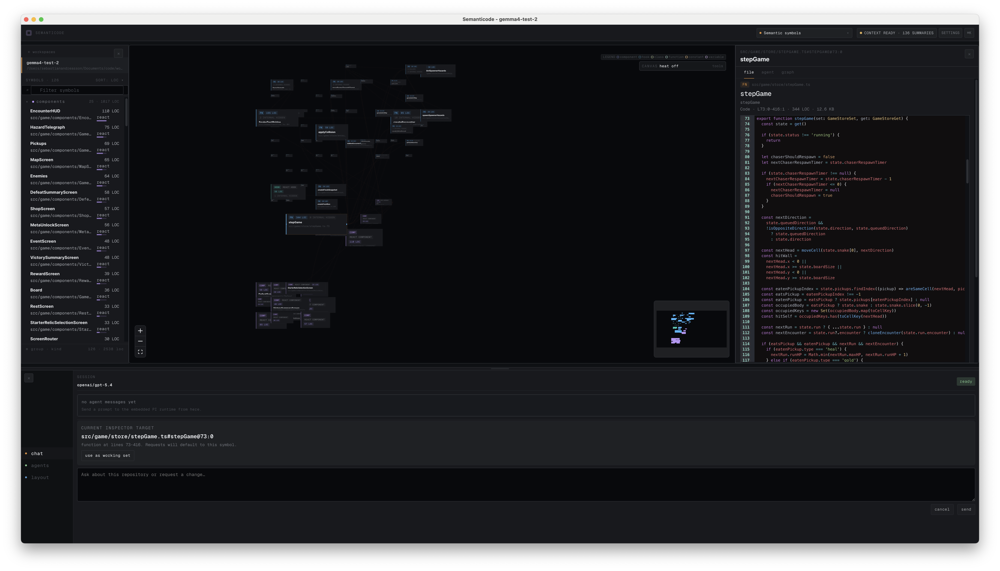

# SemantiCode

SemantiCode is a standalone code editor for agentic software work. It turns a
repository into an interactive codebase map, keeps code reading close to the
graph, and gives agents first-class surfaces for chat, autonomous TODO runs,
layout planning, and telemetry.



The primary experience is the Electron desktop app: open a workspace, inspect
the file/symbol graph, ask agents to work with scoped context, follow autonomous
runs as they move through the codebase, and use telemetry heat to see where agent
attention is going.

## What It Does

- Visualizes a workspace as a graph of files, symbols, imports, containment, and
  call relationships.
- Provides a code-first inspector with highlighted symbol ranges, git diff
  context, graph metadata, telemetry, and agent/session context.
- Runs interactive agent chat from the bottom drawer instead of a separate
  detached assistant UI.
- Runs autonomous TODO workflows through
  `@sebastianandreasson/pi-autonomous-agents` / `pi-harness`.
- Reads package telemetry artifacts to show token/request activity as codebase
  heat on files and symbols.
- Supports follow-agent behavior for recent edits/activity on the canvas and in
  the inspector.
- Generates custom layouts through a query-first layout planner instead of
  dumping the whole graph into an agent prompt.
- Adds project semantics on top of language analysis, currently including a
  bundled React plugin for components, hooks, and client components.

## Editor Surfaces

- **Left rail**: workspace switching plus a grouped symbol outline sorted by
  semantic category and LOC.
- **Canvas**: zoomable codebase graph with layouts, semantic search, call/import
  layers, minimap, compare overlays, and agent heat.
- **Inspector**: tabbed file/code, graph, and agent context reading surface.
- **Bottom drawer**: primary agent surface with `chat`, `agents`, and `layout`
  tabs.
- **Runs view**: starts/stops autonomous TODO runs and shows progress, failures,
  scope, and token usage where telemetry is available.

## Language And Semantics Support

Current analysis support:

- **TypeScript / JavaScript**: files, symbols, imports, JSX-aware React facts,
  and call graph edges.
- **Rust**: Cargo workspace/target discovery, symbol extraction, containment,
  `use` / `mod` dependency edges, and optional call edges when `rust-analyzer`
  is available.
- **Project semantics plugins**: built-in React classification for
  `react:component`, `react:hook`, and `react:client-component` facets.

The graph model is intentionally mixed-workspace friendly: a monolith can show a
React frontend, backend code, config files, tests, and generated layouts in one
canvas without forcing the project into one framework type.

## Agentic Workflow

SemantiCode is designed around agents doing real repository work:

- **Interactive chat** keeps the current workspace, selection, working set, and
  inspector context available to the agent.
- **Autonomous runs** use the repo TODO source, preferring `TODOS.md`, then
  `TODOs.md`, then `TODO.md`.
- **Telemetry** consumes repo-local `pi-output/*` and `.pi-runtime/runs/*`
  artifacts, plus best-effort interactive request telemetry.
- **Agent heat** overlays recent token/request attribution onto the visible
  graph.
- **Follow agent** can move the canvas and inspector toward recent edit/activity
  targets.
- **Layout planning** uses compact query tools and selector-based proposals so
  agents can create useful custom layouts without reading or emitting the full
  graph.

## Run The Desktop App

Install dependencies and launch the desktop host:

```bash
npm install
npm run desktop -- /path/to/repo
```

If you omit the path, the desktop app opens to workspace selection.

During normal use SemantiCode may write repo-local working data such as:

- `.semanticode/` for cache, helper instructions, and local editor artifacts.
- `.pi-runtime/` and `pi-output/` for autonomous run state and telemetry.
- `.pi/extensions/` when request telemetry is enabled for Pi/Codex activity.

## Standalone Web Runner

The package still includes a standalone local web runner:

```bash
npx semanticode .
```

Optional host/port:

```bash
npx semanticode . --port 3210 --host 127.0.0.1
```

The desktop app is the primary product shell, but the standalone runner remains
useful for quick visualization and package-level integration testing.

## Package Surface

SemantiCode still exposes the library pieces used by the app and integrations:

```ts
import { Semanticode } from 'semanticode'
import { readProjectSnapshot } from 'semanticode/node'
import { semanticodePlugin } from 'semanticode/vite'
```

Exports include:

- `semanticode` CLI
- React renderer component
- Node snapshot reader
- Vite plugin
- planner APIs
- public schema/types
- bundled stylesheet via `semanticode/style.css`

## Local Development

```bash
npm install
npm run dev
```

Common checks:

```bash
npm run lint
npm run build
npm run test
npm run test:visual
```

Build output is emitted into `dist/`, including the library bundles, standalone
app assets, Electron desktop entrypoints, and type declarations.
